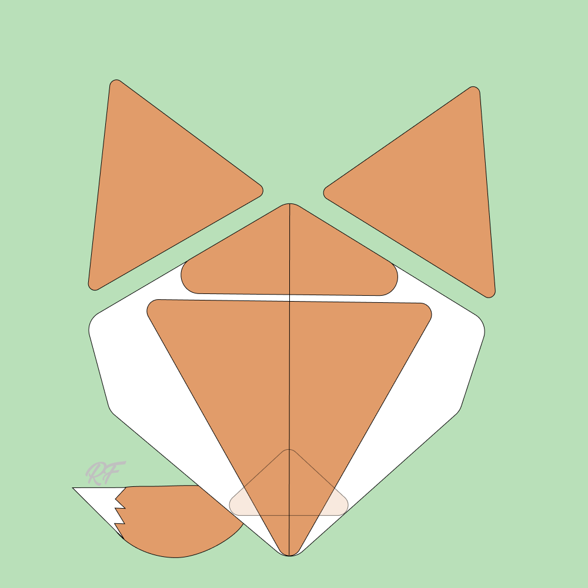

# NFT-Implementierung
Erstellung der Bilder und Metadaten für die Test NFT Kollektion unter der Anwendung der Art Engine von Hashlips (2022) sowie der Implementierung auf der Solana Blockchain mit der Candy Machine v2  von Metaplex (2022).


Pretest Bild Generierung
Der Pretest dient innerhalb des Engineering Design Prozesses die Lösungsansätze für die Problemstellung auszuprobieren und wurde als erster Versuch ausgeführt.

Die Art Engine vom Github Repository von Hashlips (2022) ermöglicht die Erstellung der NFTs mit mehreren Möglichkeiten.
In diesem Pretest beschränkt sich die Durchführung auf die Verwendung des Testsatzes an Bildern zur Erstellung der Bilder und Metadaten des NFTs.
Der Pretest umfasst 5 erstellte Bilder und die dazugehörigen Metadaten.

Im const.js File werden die verschiedenen Variablen und dessen Funktion zur Ausführung kurz beschrieben anhand der Möglichkeiten bei der Konfiguration.
Nicht verwendete Variablen und dessen Funktionen sind ausgeklammert und werden als weitere Möglichkeit der Erstellung kurz erläutert.

Alle Daten beziehen sich auf die vom Youtube Kanal Hashlips (2022) bezogenen Files auf Github und deren für die in diesem Projektrahmen geeignete Lizensierung von Hashlips (2021).
Für die Durchführung wurde die aktuelle Version von node.js sowie NPM und Yarn installiert siehe Datei [README_Hashlips Art Engine](https://github.com/rfuchs94/NFT-Implementierung/blob/main/Art%20Engine/README_Hashlips%20Art%20Engine.md) von Botha (2022) für die detaillierte Anleitung.

Die Implementierung beschränkt sich auf die Anwendung und Erläuterung der Funktionen in den Kommentaren und ist keine eigene Erstellung. Die Umsetzung dient der Anwendung bestehender Programme im Rahmen der Bachelor Thesis als Bestandteil der Referenzimplementierung.


Im Rahmen des Pretests wurden mit der Ausführung der Hashlips Art Engine folgende 5 Bilder und Metadaten generiert: 

[Pretest Bilder](https://github.com/rfuchs94/NFT-Implementierung/tree/main/Art%20Engine/build/images) </br>
[Pretest Metadaten](https://github.com/rfuchs94/NFT-Implementierung/tree/main/Art%20Engine/build/json)




Zugehörige Metadaten der Bilddatei

```json
{
  "name": "rf test #0",
  "symbol": "RF",
  "description": "thats a test",
  "seller_fee_basis_points": 700,
  "image": "0.png",
  "external_url": "https://www.youtube.com/c/hashlipsnft",
  "edition": 0,
  "attributes": [
    {
      "trait_type": "Background",
      "value": "Black"
    },
    {
      "trait_type": "Eyeball",
      "value": "Red"
    },
    {
      "trait_type": "Eye color",
      "value": "Yellow"
    },
    {
      "trait_type": "Iris",
      "value": "Small"
    },
    {
      "trait_type": "Shine",
      "value": "Shapes"
    },
    {
      "trait_type": "Bottom lid",
      "value": "Middle"
    },
    {
      "trait_type": "Top lid",
      "value": "Low"
    }
  ],
  "properties": {
    "files": [
      {
        "uri": "0.png",
        "type": "image/png"
      }
    ],
    "category": "image",
    "creators": [
      {
        "address": "7fXNuer5sbZtaTEPhtJ5g5gNtuyRoKkvxdjEjEnPN4mC",
        "share": 100
      }
    ]
  }
}
```


Quellen: <br>
https://github.com/HashLips/hashlips_art_engine <br>
https://github.com/rfuchs94/NFT-Implementierung/blob/main/LICENSE
